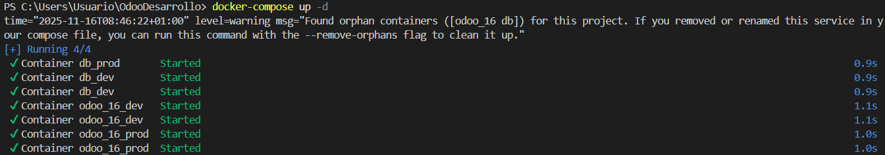
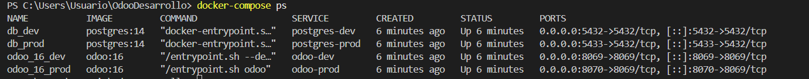

## PR0201: Entorno de producción de desarrollo contenerizado


**Objetivo:**
Con esta práctica vamos a ser si has comprendido bien los conceptos de Docker Compose. El objetivo será, partiendo del fichero compose.yml facilitado por el profesor, levantar un entorno de contenedores que tenga una instalación de Odoo para desarrollo y otra para producción. Las características de este entorno serán:

El fichero compose tendrá 4 servicios: dos con Postgres (desarrollo y producción) y dos con Odoo (desarrollo y producción)
El entorno de producción únicamente tendrá mapeado el volumen /mnt/extra/addons mientras que el de desarrollo tendrá los 4 directorios que vimos en la exposición del tema (addons, filestore, sessions y base de datos).
Es decisión tuya qué puertos mapearás a la máquina física.
**Entrega**
Debes documentar los pasos tomados, así como entregar el fichero compose.yml que hayas creado.

<br>

**Resolución**


1. **Modificación del archivo `compose.yml`** con 4 servicios:
   - postgres-dev, odoo-dev *(desarrollo)*
   - postgres-prod, odoo-prod *(producción)*
  
```yaml
   services:
  # Desarrollo - Base de datos
  postgres-dev:
    image: postgres:14
    container_name: db_dev
    environment:
      - POSTGRES_DB=postgres
      - POSTGRES_USER=odoo
      - POSTGRES_PASSWORD=paso
    ports:
      - "5432:5432"
    volumes:
      - C:/Users/Usuario/OdooDesarrollo/dataPG_dev:/var/lib/postgresql/data

  # Desarrollo - Odoo
  odoo-dev:
    image: odoo:16
    container_name: odoo_16_dev
    environment:
      - HOST=postgres-dev
      - USER=odoo
      - PASSWORD=paso
    ports:
      - '8069:8069'
    volumes:
      - C:/Users/Usuario/OdooDesarrollo/volumesOdoo_dev/addons:/mnt/extra-addons
      - C:/Users/Usuario/OdooDesarrollo/volumesOdoo_dev/filestore:/var/lib/odoo/filestore
      - C:/Users/Usuario/OdooDesarrollo/volumesOdoo_dev/sessions:/var/lib/odoo/sessions
    depends_on:
      - postgres-dev
    command: --dev=all

  # Producción - Base de datos
  postgres-prod:
    image: postgres:14
    container_name: db_prod
    environment:
      - POSTGRES_DB=postgres
      - POSTGRES_USER=odoo
      - POSTGRES_PASSWORD=paso
    ports:
      - "5433:5432"
    
  # Producción - Odoo
  odoo-prod:
    image: odoo:16
    container_name: odoo_16_prod
    environment:
      - HOST=postgres-prod
      - USER=odoo
      - PASSWORD=paso
    ports:
      - '8070:8069'
    volumes:
      - C:/Users/Usuario/OdooDesarrollo/volumesOdoo_prod/addons:/mnt/extra-addons
    depends_on:
      - postgres-prod
      
```
2. **Apertura de Docker Desktop:**

3. **Levantar los servicios:**
   ```bash
   docker-compose up -d
   ```
   

4. **Verificación de estado:**
   ```bash
   docker-compose ps
   ```
