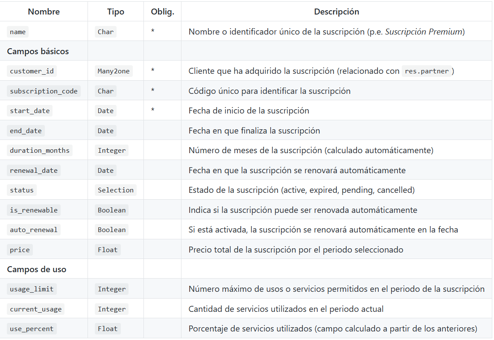

## PR0604: Vista de tipo lista


**¿Qué vamos a aprender?**
En esta primera práctica sobre vistas practicaremos con las principales opciones que tiene la vista de tipo lista para personalizar los datos que se muestran al usuario


**¿Qué recursos me pueden ser útiles?**
A continuación se indican algunos recursos que complementan los apuntes del módulo y que te pueden ser útiles para realizar esta práctica:

- Widgets


**¿Qué hay que hacer?**
Vas a crear un módulo sobre gestión de suscripciones que llamarás subscription.
Los campos que tendrá este módulo serán los siguientes:


Vas a crear dos vistas de tipo árbol que muestren datos sobre el mismo modelo. Estas vistas tendrán los siguientes datos:

- Vista de datos básicos: el nombre y los campos que están marcados como básicos en la tabla
- Vista de uso: el nombre y los campos que están marcados como campos de uso en la tabla
Para hacer esto necesitas dos definiciones diferentes de la vista, cada uno con un identificador propio y hacer referencia a cada uno de estos identificadores en la acción del menú correspondiente mediante una etiqueta field con el atributo view_id, como puedes ver en el siguiente fragmento de código:

```xml
    <record id="view_subscription_tree_basic" model="ir.ui.view">
        ...
    <record id="view_subscription_tree_usage" model="ir.ui.view">
        ...

    <record id="action_subscription_basic" model="ir.actions.act_window">
        <field name="name">Suscripciones (Básico)</field>
        <field name="res_model">subscription.management</field>
        <field name="view_mode">tree,form</field>
        <field name="view_id" ref="view_subscription_tree_basic"/>
    </record>
    <record id="action_subscription_usage" model="ir.actions.act_window">
        <field name="name">Suscripciones (Uso)</field>
        <field name="res_model">subscription.management</field>
        <field name="view_mode">tree,form</field>
        <field name="view_id" ref="view_subscription_tree_usage"/>
    </record>

```
La vista tiene que tener las siguientes características (se hará en la vista correspondiente):

- El título de cada campo será una cadena comprensible (por ejemplo, el campo usage_limit se podría mostrar como límite de uso)
- Se marcarán en color rojo las líneas cuyo estado sea expired y en amarillo las que tienen el estado cancelled.
- Si se ha superado el 80% de uso de servicios se marcará ese campo en color rojo.
- El campo usage_limit se mostrará como una barra de porcentaje
- En cada página se mostrará 15 registros
- Al final de cada página se mostrará la media de uso de todas las suscripciones
- El campo end_date lo mostrarás con el widget remaining_days.
- El campo status se mostrará con el widget radio.
- El campo price no se mostrará si el valor de status es cancelled
- Añade un botón que, al pulsarlo, añada 15 días a la duración de la suscripción


**¿Qué hay que entregar?**

Debes entregar:

- Al igual que todas las prácticas, tendrás que documentar los pasos más relevantes en formato Markdown e incluirlo en tu repositorio.
- En la documentación tienes que incluir el código de todos los ficheros del proyecto que edites.
- También debe incluir una captura de pantalla donde se vea como el módulo funciona correctamente.

**Solución**

- [Documentación](./PasosResolucion.pdf)
- [Ficheros editados](./CodigosEditados.pdf)
- [Solución](Solucion.pdf)