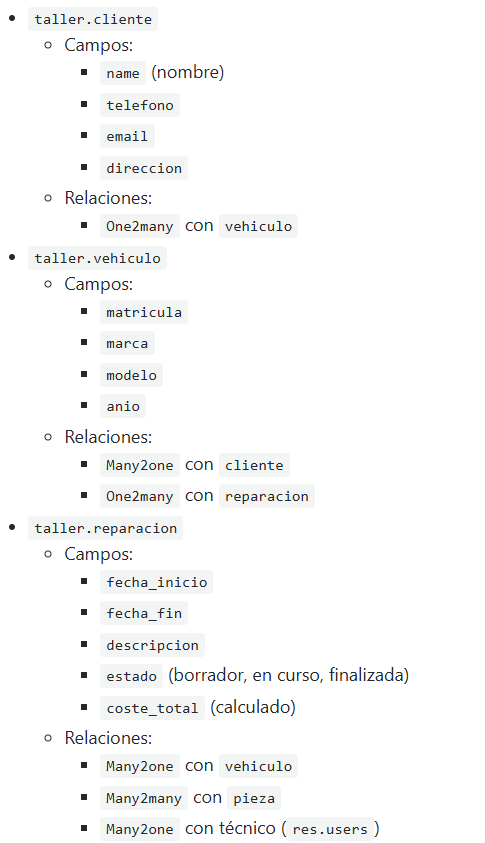
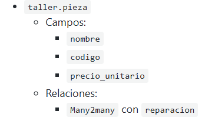

## PR0606: Gestión de un taller mecánico

El objetivo de esta práctica es diseñar y desarrollar un módulo personalizado de Odoo para la gestión interna de un pequeño taller mecánico, incluyendo el registro de clientes, vehículos, reparaciones, piezas utilizadas y técnicos

**Requisitos funcionales**
Tu módulo deberá tener los siguientes modelos:

**¿Qué hay que hacer?**
Los campos que tendrá este módulo serán los siguientes:

**Interfaz de usuario (vistas)**

El módulo debe incluir una interfaz gráfica completa para cada uno de los modelos definidos, definiendo una vista de tipo árbol y otra de tipo formulario para cada uno de los modelos.

La vista debe incluir por lo menos las siguientes características:

- Todas las vistas deben incluir todos los datos del modelo correspondiente.
- Modelo pieza
Se debe colorear cada registro según el precio:
Precio < 10 € → color verde.
Precio > 100 € → color rojo.
Precio intermedio → sin color.
- En el mismo modelo se debe validar que el precio sea superior a 0
- Modelo reparación
Se debe colorear la columna estado:
Borrador → gris
En curso → azul
Finalizada → verde
- Se debe incluir un botón para cambiar de estado disponiendo de las opciones “Abrir reparación”, “Cerrar reparación” y “Reabrir”
- El campo coste_total se coloreará según los siguientes criterios:
Mayor de 500 € → rojo
Entre 100 y 500 € → naranja
Menor de 100 € → verde
- Si el estado es “finalizada”, todos los campos quedan deshabilitados (readonly), excepto el botón de reabrir

**¿Qué hay que entregar?**

Debes entregar:

- Al igual que todas las prácticas, tendrás que documentar los pasos más relevantes en formato Markdown e incluirlo en tu repositorio.
- En la documentación tienes que incluir el código de todos los ficheros del proyecto que edites.
- También debe incluir una captura de pantalla donde se vea como el módulo funciona correctamente.

**Solución**

- [Documentación](./PasosResolucion.pdf)
- [Ficheros editados](./CodigosEditados.pdf)
- [Solución](Solucion.pdf)